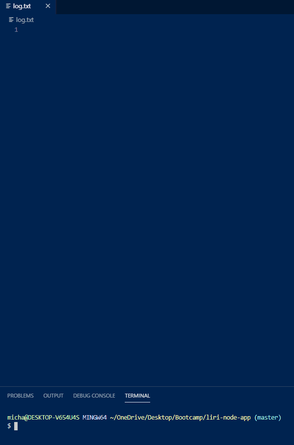

# LIRI Bot
With LIRI Bot, you can easily find concert dates and locations, song details, and movie information.

## Overview
LIRI (Language Interpretation and Recognition Interface) Bot is a command line node application that takes in a variety of parameters and returns corresponding data. To accomplish this, it utilizes three API's: BandsInTown, Spotify, and OMDB. Along with these API's, LIRI Bot was built with node.js, axios, moment.js, and dotenv.

## Installation
1. Obtain the API keys mentioned above
2. Clone the repository below
```sh
git clone git@github.com:MR-Stan/liri-node-app.git
```
3. Install NPM packages
```sh
npm i
```
4. Create a .env file and insert the information below with your keys 
```JS
SPOTIFY_ID = API Key

SPOTIFY_SECRET =  Secret Key
```

## Operation
LIRI Bot currently supports the following commands:
* [concert-this](#concert-this)
* [spotify-this-song](#spotify-this-song)
* [movie-this](#movie-this)
* [do-what-it-says](#do-what-it-says)

### concert-this
Command: 'node liri.js concert-this (artist / band name)'

The BandsInTown API is queried for upcoming concerts and returns:
* The name of the venue
* The venue location
* The date of the event (MM/DD/YYYY)


### spotify-this-song
Command: 'node liri.js spotify-this-song (song name)'

The Spotify API is queried for song information:
* Song title
* Album title
* Artist(s) name
* Preview URL


### movie-this
Command: 'node liri.js movie-this (movie name)'

The OMDB API is queried for movie information:
* Title
* Year released
* IMDB rating
* Rotten Tomatoes rating
* Country
* Language
* Plot
* Actors


### do-what-it-says
Command: 'node liri.js do-what-it-says'
Note: The outcome of the above command is determined by the contents of the random.txt file


### log.txt
Each time a command is entered, log.txt is appended with the resulting data

